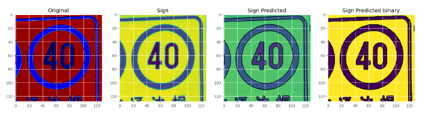

 

This paper advances and builds on existing knowledge to introduce a novel solution with an already existing algorithm for detecting a traffic sign and estimate the boundary within and input image. Estimating the boundary of traffic signs within an image and classification of a shape class prediction, solved using a CNN. The proposed algorithm and method using a U-Net CNN is compared aganist existing CNN methods in terms of computational time, and accuracy of detection.

<figure style="text-align: center">

<figcaption style="text-align: center">
    <em> Traffic Sign Image Segmentation</em>
  </figcaption>
</figure>

Utilizing the UNet algorithm that is traditionally used for Medical Imaging, and utilizing it for image segmentation of traffic sign data. The Data sets were gathered from Kaggle opensource datasets and the training was done off a jupyter notebook.

The model was trained using tensorflow, building the model and tweaking the model configurations to maxmize model performance. I utilizied a Rectified Linear Unit Activation (ReLu) in between Convolution layers then trained for only 30 epochs as the model would reach reach maximum accuracy relatively quickly. 

<figure style="text-align: center">

<figcaption style="text-align: center">
    <em> Unet Architecture </em>
  </figcaption>
</figure>

More details about the model can be found in the paper.

Research Project Final paper: 

<embed src="assets/resu/EE8204_Final_Report.pdf" type="application/pdf" class="col-lg-12" width="600" height="800" />
        
 
 
<h4>Libraries:</h4>
Some of the tools required to make this project work: 
 

<a href="https://www.mysql.com/">MySQL</a> - MySQL is a domain-specific language used in programming and designed for managing data held in a relational database management system.  
<a href="https://www.tensorflow.org/">TensorFlow</a> - TensorFlow is a free and open-source software library for machine learning and artificial intelligence. It can be used across a range of tasks but has a particular focus on training and inference of deep neural networks  
<a href="https://jupyter.org/">Jupyter Notebooks</a> - web-based interactive development environment for notebooks, code, and data. 
